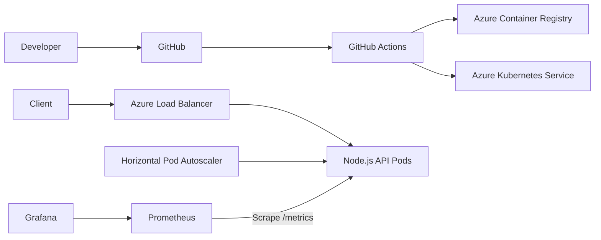

# Cloud-Native Task API

A portfolio-ready Node.js REST API demonstrating Docker containerisation, Kubernetes deployment, Azure Kubernetes Service, GitHub Actions CI/CD, autoscaling, health probes, Prometheus metrics, and Grafana dashboards.

## Architecture



## Technologies

- Node.js and Express
- Docker and Docker Compose
- Kubernetes and Azure Kubernetes Service
- Azure Container Registry
- GitHub Actions
- Prometheus and Grafana

## API endpoints

| Method | Endpoint | Purpose |
|---|---|---|
| GET | `/` | Service information |
| GET | `/healthz` | Liveness probe |
| GET | `/readyz` | Readiness probe |
| GET | `/api/tasks` | List tasks |
| POST | `/api/tasks` | Create a task |
| PATCH | `/api/tasks/:id` | Update a task |
| DELETE | `/api/tasks/:id` | Delete a task |
| GET | `/metrics` | Prometheus metrics |

The task store is intentionally in-memory because this project focuses on deployment, scaling, automation, and observability.

## Run locally

```bash
npm install
npm test
npm start
```

Open `http://localhost:3000`.

Create a task:

```bash
curl -X POST http://localhost:3000/api/tasks \
  -H 'Content-Type: application/json' \
  -d '{"title":"Deploy the API to AKS"}'
```

## Run with Docker, Prometheus, and Grafana

```bash
docker compose up --build
```

- API: `http://localhost:3000`
- Prometheus: `http://localhost:9090`
- Grafana: `http://localhost:3001`
- Local Grafana login: `admin` / `admin`

## Kubernetes deployment

The `k8s/app` directory includes:

- Namespace and ConfigMap
- LoadBalancer Service
- Hardened Deployment with non-root execution
- Liveness and readiness probes
- CPU and memory requests and limits
- Rolling updates
- Horizontal Pod Autoscaler
- PodDisruptionBudget

Replace `IMAGE_PLACEHOLDER` in `k8s/app/deployment.yaml` with your container image before applying it manually. The GitHub Actions deployment workflow performs this replacement automatically.

## Provision Azure infrastructure

Azure resources incur charges. Delete the resource group after the demonstration when it is no longer needed.

```bash
az login
RESOURCE_GROUP=cloud-native-task-api-rg \
LOCATION=australiaeast \
AKS_CLUSTER=cloud-native-task-api-aks \
ACR_NAME=<globally-unique-lowercase-name> \
bash scripts/provision-azure.sh
```

The script creates an Azure resource group, Azure Container Registry, and a two-node AKS cluster with managed identity and ACR access.

## Configure GitHub Actions

Create these repository variables under **Settings → Secrets and variables → Actions → Variables**:

```text
AZURE_RESOURCE_GROUP=cloud-native-task-api-rg
AKS_CLUSTER_NAME=cloud-native-task-api-aks
ACR_NAME=<your-acr-name>
```

Create these repository secrets for Azure OpenID Connect authentication:

```text
AZURE_CLIENT_ID=<application-client-id>
AZURE_TENANT_ID=<azure-tenant-id>
AZURE_SUBSCRIPTION_ID=<azure-subscription-id>
```

The workflows provide:

- Automated syntax checks and API tests
- Docker image build verification
- Image publishing to Azure Container Registry
- Deployment to Azure Kubernetes Service
- Kubernetes rollout verification

## Deploy Prometheus and Grafana to Kubernetes

```bash
GRAFANA_PASSWORD='<strong-password>' bash scripts/deploy-monitoring.sh
```

Then port-forward the services:

```bash
kubectl port-forward service/prometheus 9090:9090 -n cloud-native
kubectl port-forward service/grafana 3001:3000 -n cloud-native
```

The included Grafana dashboard displays request rate, p95 latency, server error ratio, and process memory.

## Useful commands

```bash
kubectl get pods,services,hpa -n cloud-native
kubectl logs deployment/task-api -n cloud-native
kubectl describe hpa task-api -n cloud-native
kubectl rollout status deployment/task-api -n cloud-native
```

## Clean up Azure

```bash
az group delete --name cloud-native-task-api-rg --yes --no-wait
```

## Resume description

**Cloud-Native Application Deployment**  
*Node.js, Docker, Kubernetes, Azure, GitHub Actions, Prometheus, Grafana*

- Containerised a Node.js REST API using a multi-stage Docker build and deployed it to Azure Kubernetes Service with health probes, resource controls, rolling updates, and horizontal autoscaling.
- Built GitHub Actions CI/CD workflows to run automated tests, publish versioned images to Azure Container Registry, and deploy updates to Kubernetes.
- Configured Kubernetes Deployments, Services, ConfigMaps, PodDisruptionBudget, and HorizontalPodAutoscaler resources to support repeatable and scalable delivery.
- Instrumented the application with Prometheus metrics and provisioned Grafana dashboards to monitor request volume, latency, errors, process memory, and service health.

## Licence

MIT
